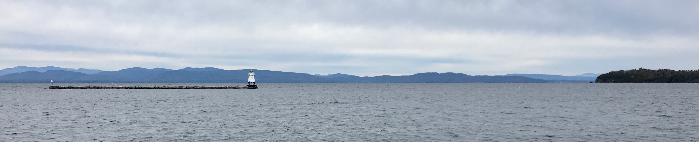
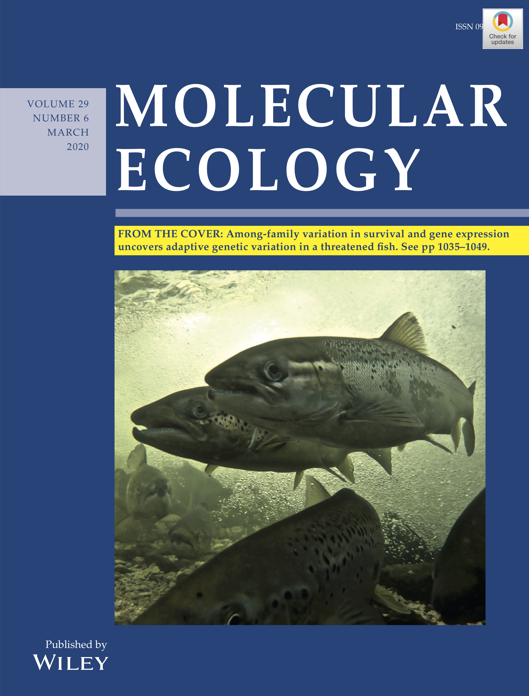
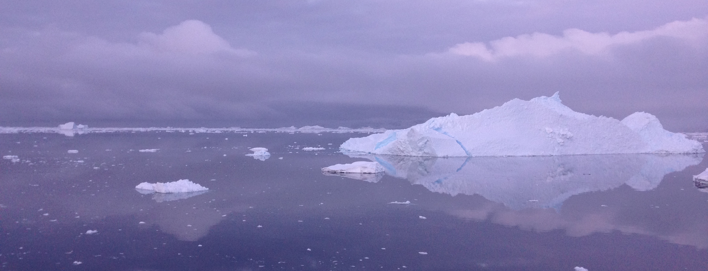

<!-- Main -->

<!-- Content -->
<h2 id="content">Education</h2>
<!-- 
 -->
<ul class="alt">
<!-- <ul> -->
	<li><b>PhD Biological Sciences</b>, Purdue University (December 2020) &nbsp;&nbsp;&nbsp;&nbsp;&nbsp;•&nbsp;&nbsp;Computational Life Sciences concentration</li>
	<li><b>MS Biology</b>, Central Michigan University (August 2015)</li>
	<li><b>BS Biological Sciences</b>, Eastern Illinois University (December 2012) &nbsp;&nbsp;&nbsp;&nbsp;&nbsp;•&nbsp;&nbsp;Chemistry minor</li>
	<li><b>ASA Science and Arts</b>, Olney Central College (May 2010)</li>
	</ul>
	  

<h2 id="content">Publications</h2>
<ol>
<li>DeWoody JA, <strong>Harder AM</strong>, Mathur S, and Willoughby JR. The long-standing significance of genetic diversity in conservation. <a href="https://onlinelibrary.wiley.com/doi/10.1111/mec.16051"><i>Molecular Ecology</i> 30:4147-4154.</a>  </li>
<li>Yin X, Martinez AS, Perkins A, Sparks MM, <strong>Harder AM</strong>, Willoughby JR, Sepúlveda MS, and Christie MR. Incipient resistance to an effective pesticide results from genetic adaptation and the canalization of gene expression. <a href="https://onlinelibrary.wiley.com/doi/full/10.1111/eva.13166"><i>Evolutionary Applications</i> 14:847-859.</a>  </li>

	

		

	

<li><strong>Harder AM</strong>, Willoughby JR, Ardren WR, and Christie MR. 2020. Among family variation in survival and gene expression uncovers adaptive genetic variation in a threatened fish. <a href="https://onlinelibrary.wiley.com/doi/epdf/10.1111/mec.15334?author_access_token=-XDcx9R46qppwnBPZyABZIta6bR2k8jH0KrdpFOxC66cOyIjtA07Q-qM0QCJqG82HPl1rD93VUm42QPKHBuqiCXLsA6sEeq_6Dh-fYxL_PPFV2d5Ip0Ccf3OL8_7HuK5"><i>Molecular Ecology</i> 29:1035-1049</a>.  

Featured as a 'From the Cover' article and highlighted in a <a href="https://onlinelibrary.wiley.com/doi/10.1111/mec.15389">Perspective piece</a> by Dr. Mariah Meek  

<li><strong>Harder AM</strong>, Ardren WR, Evans AN, Futia MH, Kraft CE, Marsden JE, Richter CA, Rinchard J, Tillitt DE, and Christie MR. 2018. Thiamine deficiency in fishes: causes, consequences, and potential solutions. <a href="https://link.springer.com/article/10.1007%2Fs11160-018-9538-x"><i>Reviews in Fish Biology and Fisheries</i> 28:865-886</a>.  </li>

<li>Willoughby JR, <strong>Harder AM</strong>, Tennessen JA, Scribner KT, and Christie MR. 2018. Rapid genetic adaptation to a novel environment despite a genome-wide reduction in genetic diversity. <a href="https://onlinelibrary.wiley.com/doi/full/10.1111/mec.14726"><i>Molecular Ecology</i> 27:4041-4051</a>.  </li>

<li>Dömel JS, Melzer RR, <strong>Harder AM</strong>, Mahon AR, and Leese F. 2017. Nuclear and mitochondrial gene data support recent radiation within the sea spider species complex Pallenopsis patagonica. <a href="https://www.frontiersin.org/articles/10.3389/fevo.2016.00139/full"><i>Frontiers in Ecology and Evolution</i> 4:139</a>.  </li>

<li><strong>Harder AM</strong>, Halanych KM, and Mahon AR. 2016. Diversity and distribution within the sea spider genus Pallenopsis(Chelicerata: Pycnogonida) in the Western Antarctic as revealed by mitochondrial DNA. <a href="https://link.springer.com/article/10.1007%2Fs00300-015-1823-8"><i>Polar Biology</i> 39:677-688</a>.  </li>

<li>Dietz L, Arango C, Dömel JS, Halanych KM, <strong>Harder AM</strong>, Held C, Mahon AR, Mayer C, Melzer RR, Rouse GW, Weis A, Wilson NG, and Leese F. 2015. Regional differentiation and extensive hybridization between mitochondrial clades of the Southern Ocean giant sea spider Colossendeis megalonyx. <a href="https://royalsocietypublishing.org/doi/full/10.1098/rsos.140424?url_ver=Z39.88-2003&rfr_id=ori:rid:crossref.org&rfr_dat=cr_pub%3dpubmed"><i>Royal Society Open Science</i> 2:140424</a>.  </li>

<b>Submitted</b>  

<li><strong>Harder AM</strong> and Christie MR. Genomic signatures of adaptation to novel environments: hatchery and life-history associated loci in landlocked and anadromous Atlantic salmon (<i>Salmo salar</i>).  </li>

<li>Willoughby JR, <strong>Harder AM</strong>, Sundaram M, Mathur S, Bylsma R, and DeWoody JA. Vertebrate divergence estimates vary more than two-fold among lineages but far less 	than expected between nuclear and mitochondrial genomes.  </li>

<li>Willoughby JR, Sundaram M, <strong>Harder AM</strong>, Mathur S, Bylsma R, and DeWoody JA. Predictors of nuclear and mitochondrial genome divergence in congeneric vertebrates.  </li>

<b>Educational resources (peer-reviewed)</b>  
<li><strong>Harder AM</strong>, Willoughby JR, Doyle JM. 2018. Peppered moths and the Industrial Revolution: barking up the wrong tree? <a href="http://sciencecases.lib.buffalo.edu/cs/files/moths.pdf"><i>National Center for Case Study Teaching in Science</i></a>.  </li>

<li>Willoughby JR, <strong>Harder AM</strong>, Doyle JM. 2018. Fish out of (salt) water: adaptation of an ocean-going fish to freshwater environment. <a href="http://sciencecases.lib.buffalo.edu/cs/files/steelhead_adaptation.pdf"><i>National Center for Case Study Teaching in Science</i></a>.</li>
<ol></ol>

 

<ul class="actions fit small">
<!-- 
	<li><a href="#" class="button special fit small">Download AMH CV</a></li>
	  
	<li><a href="#" class="button fit small">Download AMH CV</a></li>
	  
 -->
	<li><a href="{{ site.baseurl }}/assets/images/amh_cv.pdf" class="button default">Download AMH CV</a></li>
</ul>

	
<ul class="actions fit small">
 	<li><a href="https://scholar.google.com/citations?user=uyxk3voAAAAJ&hl=en" class="button default">Google Scholar Profile</a></li>
</ul>

