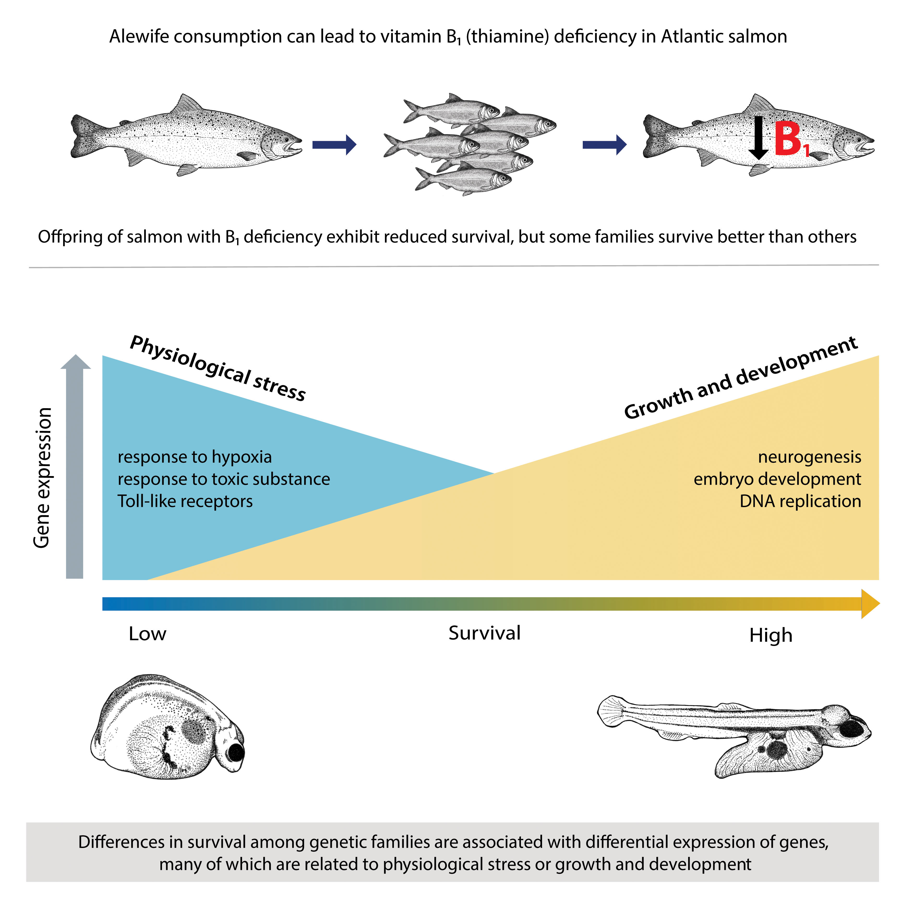

<!-- Main -->

<!-- One -->
<section id="one">
	

		<header class="major">
			<h2>Supplementation programs</h2>
		</header>
		
[Define supplementation programs, talk about why they might be implemented, maybe include a map of supplemented populations?]

	

</section>

<!-- Two -->
<section id="two" class="spotlights">
	<section>

	
	
		

			

				
[A paragraph on previous findings on proportion hatchery fish and productivity, e.g., Chilcote et al.]

			

		

	</section>
	<section>
		
		

			

				<header class="major">
					<h3>Density-dependent fitness</h3>
				</header>
				
[Paragraph on what it is, why it might occur, how hatcheries could contribute]

			

		

	</section>
</section>

<!-- Three -->
<section id="three">
	

		<header class="major">
			<h3>Identifying putatively adaptive genes</h3>
		</header>
		
The goals of this portion of the project included using experimental transcriptomics to:
				<ol>
					<li>Identify genes differentially expressed between thiamine treated and untreated individuals to characterize the effects of thiamine deficiency on metabolic pathways</li>
					<li>Describe patterns of gene expression associated with differential survival among families to determine whether gene expression patterns support a genetic basis for thiamine requirement</li>
				</ol>
Very briefly, we identified over 3,600 genes differentially expressed in response to thiamine treatment. These genes were largely related to known signs and effects of thiamine deficiency, including metabolic, neurological, and cardiovascular abnormalities.   We also identified 1,400 genes with expression patterns associated with variation in survival among families (see graphical abstract below). These genes and their associated regulatory elements may play roles in an adaptive evolutionary response to thiamine deficiency. Such a response would reduce the need for hatchery thiamine treatments and help pave the way for increased natural recruitment in Lake Champlain. The patterns we describe in the associated manuscript (now in <i>Molecular Ecology</i>) suggest a genetic basis for thiamine requirement.

		<ul class="actions">
			<li><a href="https://onlinelibrary.wiley.com/doi/epdf/10.1111/mec.15334?author_access_token=-XDcx9R46qppwnBPZyABZIta6bR2k8jH0KrdpFOxC66cOyIjtA07Q-qM0QCJqG82HPl1rD93VUm42QPKHBuqiCXLsA6sEeq_6Dh-fYxL_PPFV2d5Ip0Ccf3OL8_7HuK5" class="button next">See the paper</a></li>
		</ul>
	

	

	
	

 [Cover image photo credit: W. Ardren. Fry close-up photo credit: E. Lehnert. Graphical abstract and drawings: <a href="https://www.gabrielasincich.com/news">G. Sincich</a>]
</section>

