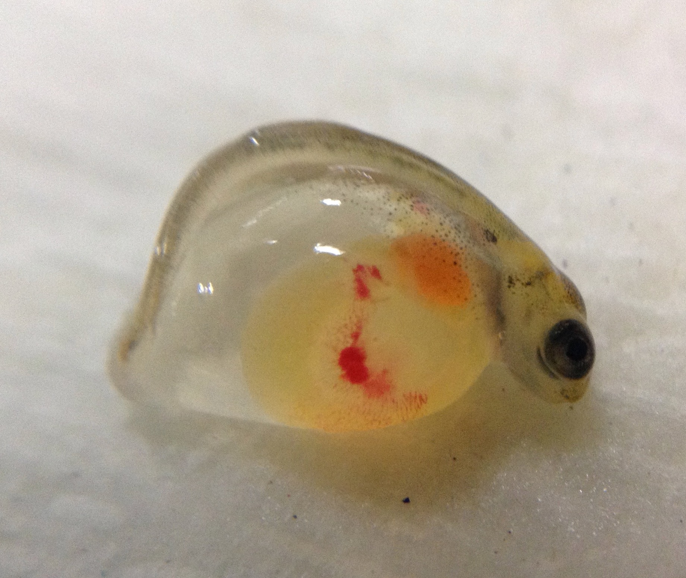
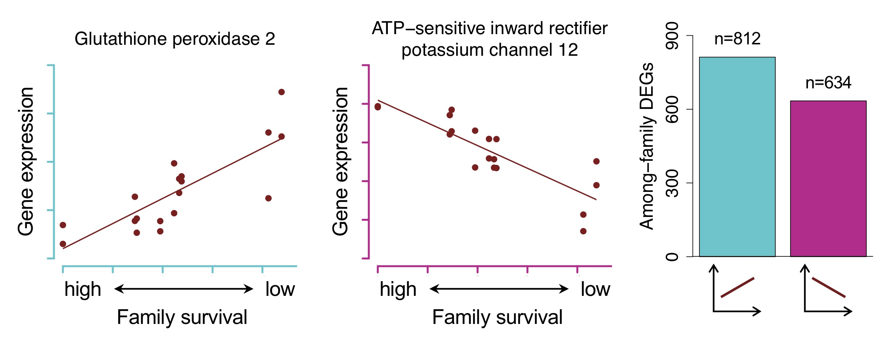

<!-- Main -->

<!-- One -->
<section id="one">
	

		<header class="major">
			<h2>The Portal Site</h2>
		</header>
		
[Description of the environment, krat ecology, mounds, etc.]

	

</section>

<!-- Two -->
<section id="two" class="spotlights">
	<section>
		
		

			

				
[A paragraph on Janna et al.'s findings about fitness in Con Gen(?) paper, link to paper]</i></a>.

			

		

	</section>
	<section>
		
		

			

				<header class="major">
					<h3>Research objective</h3>
				</header>
				
Currently, Lake Champlain hatcheries must treat collected Atlantic salmon eggs with supplemental thiamine to avoid otherwise high rates of mortality due to thiamine deficiency. However, when eggs are left untreated, we observe high variation in survival among genetically unique families. <b>The goal of this project is to determine whether or not heritable, genetic variation underlies individual differences in capacity to tolerate low thiamine.</b> If selection on this tolerance is possible, this work will help to inform hatchery practices that capitalize on the process of natural selection.

			

		

	</section>
</section>

<!-- Three -->
<section id="three">
	

		<header class="major">
			<h3>Identifying putatively adaptive genes</h3>
		</header>
		
The goals of this portion of the project included using experimental transcriptomics to:
				<ol>
					<li>Identify genes differentially expressed between thiamine treated and untreated individuals to characterize the effects of thiamine deficiency on metabolic pathways</li>
					<li>Describe patterns of gene expression associated with differential survival among families to determine whether gene expression patterns support a genetic basis for thiamine requirement</li>
				</ol>
Very briefly, we identified over 3,600 genes differentially expressed in response to thiamine treatment. These genes were largely related to known signs and effects of thiamine deficiency, including metabolic, neurological, and cardiovascular abnormalities.   We also identified 1,400 genes with expression patterns associated with variation in survival among families (see figure below). These genes and their associated regulatory elements may play roles in an adaptive evolutionary response to thiamine deficiency. Such a response would reduce the need for hatchery thiamine treatments and help pave the way for increased natural recruitment in Lake Champlain. The patterns we describe in the associated manuscript (now in <i>Molecular Ecology</i>) suggest a genetic basis for thiamine requirement.

		<ul class="actions">
			<li><a href="https://onlinelibrary.wiley.com/doi/epdf/10.1111/mec.15334?author_access_token=-XDcx9R46qppwnBPZyABZIta6bR2k8jH0KrdpFOxC66cOyIjtA07Q-qM0QCJqG82HPl1rD93VUm42QPKHBuqiCXLsA6sEeq_6Dh-fYxL_PPFV2d5Ip0Ccf3OL8_7HuK5" class="button next">See the paper</a></li>
		</ul>
	

	
 [Cover image photo credit: https://www.inaturalist.org/guide_taxa/219314]
</section>

