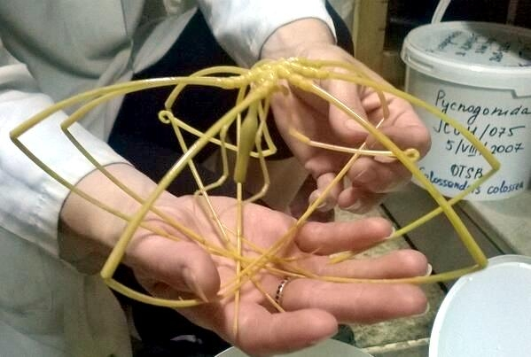
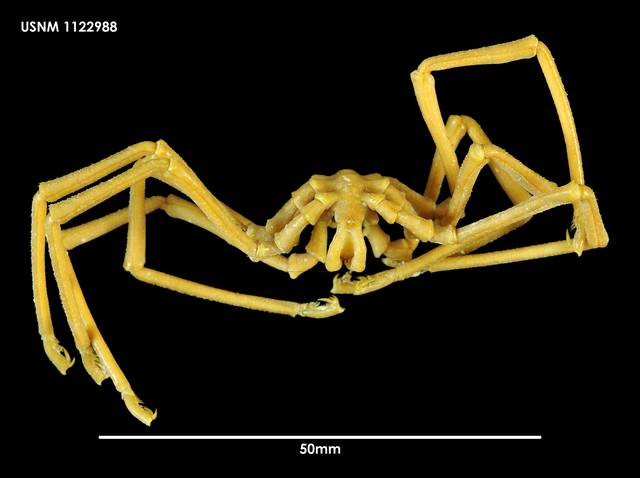

<!-- Main -->

<!-- One -->
<section id="one">
	

		<header class="major">
			<h2>Antarctic benthos</h2>
		</header>
		
The benthic creatures of Antarctica's continental shelf have experienced stable environmental conditions since becoming isolated by the formation of the Antarctic Circumpolar Current ~20-40 million years ago. In November 2013, I participated in a research cruise to the western Antarctic Peninsula. While every member of the research crew was interested in a different taxon (e.g., sea spiders, sea stars, brittle stars, nemerteans, to name a few), the unified goals of our team were to (1) document biodiversity present on the shelf before climatic shifts result in significant species and genetic diversity reductions and (2) to test long-standing presumptions such as the population-isolating effects of the Antarctic Circumpolar Current. 

	

</section>

<!-- Two -->
<section id="two" class="spotlights">
	<section>
		
		

			

				<header class="major">
					<h3>Sea spiders</h3>
				</header>
				
Sea spiders (pycnogonids) are found in all oceans of the world, from nearshore coastal areas to depths of nearly 7,000 meters. In the Southern Ocean, many sea spiders (and other invertebrates) grow to abnormally large sizes, a phenomenon known as polar gigantism (see example of <i>Colossendeis</i> at left). All species for which reproductive behaviors have been described exhibit male brooding, where males carry fertilized eggs until hatching and dispersal of offspring. This strategy is expected to extremely limit juvenile dispersal distance, relative to broadcast spawning invertebrates or species with highly mobile juvenile stages.
				
				  [Image at left from <a href="https://otlibrary.com/giant-sea-spider/">OTML</a>. Check out their gallery to see more photos, including brooding males. Note that <i>Colossendeis</i> is one genus of pycnogonid for which brooding behavior and juvenile individuals have never been observed.]

			

		

	</section>
	<section>
		
		

			

				<header class="major">
					<h3><i>Pallenopsis</i></h3>
				</header>
				
My masters research focused on one genus of Antarctic sea spider, <i>Pallenopsis</i>. I relied on the COI mitochondrial marker to describe broad patterns of genetic diversity in populations of western Antarctic coastal regions, the Scotia Arc, Falkland Islands, and the Chilean coast. My results indicated the presence of previously unidentified mitochondrial lineages and also suggested that cryptic speciation had occurred within this genus.   The most genetically diverse 'species' in my data set--and the most likely to have undergone cryptic speciation--was <i>Pallenopsis patagonica</i>. Subsequent work from Dömel et al., including nuclear genetic markers and morphological analyses, has resulted in the <a href="https://link.springer.com/article/10.1186/s12983-019-0316-y">description of two new species</a> within the <i>Pallenopsis patagonica</i> species complex. These results also suggest that divergent lineages were formed in separate glacial refugia during the last glacial maximum.

			

		

	</section>

